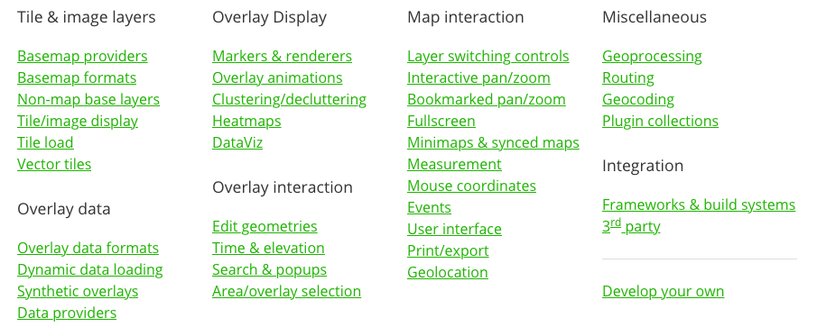

<!-- .slide: data-background="./img/2020/devsummit/bg-1.png" -->

<h1 style="text-align: left; font-size: 80px; margin-top: -90px;"><i>Building apps</i> with <b>Esri Leaflet</b></h1>
    
Patrick Arlt

    
Slides: <a href="http://bit.ly/2TrH54j" style="font-family: monospace;">http://bit.ly/2TrH54j</a>
    

---

## What is Leaflet?

Leaflet is a small, simple mapping API

* 36kb
* Raster Tiles and Grids
* Points, Lines, Polygons
* Popups
* Web Mercator Only

---

## Leaflet is plugin powered

---

## What is Esri Leaflet?

A plugin for Leaflet that simplifies integrating ArcGIS services into Leaflet.

---

## Community Powered

* Most 🌟'ed Esri GitHub project
* Most contributors of Esri's GitHub projects
* Maintained by [@patrickarlt](https://github.com/patrickarlt), [@gavinr](https://github.com/gavinr), [@jwasilgeo](https://github.com/jwasilgeo).
* No roadmap, no product lifecycle

---

## Why use Esri Leaflet?

* Small footprint
* Simple APIs
* Access other Leaflet plugins
* Open source
* Stable

---

## Why use the JS API instead

* Vastly more capabilities
* Web GL Visualization (performance)
* Widgets
* 3d
* Tighter integration with ArcGIS
  * Renderers
  * Web Maps
  * Identity
  * Editing

---

# Demos

---

## Just Leaflet

Tile Layer, Point, Line, Polygon, Popup.

[Demo](./demos/just-leaflet.html)

---

## w/ Esri Leaflet

Tile Layer, Feature Layer, Search.

[Demo](./demos/basic-esri-leaflet.html)

---

## Map Service w/ Esri Leaflet

Esri Leaflet DynamicMapLayer = JS API's MapImageLayer.

[Demo](./demos/esri-leaflet-map-service.html)

---

## Clustering w/ a plugin

Cluster markers to reduce noise and improve performance.

[Demo](./demos/clustering.html)

---

## Editing w/ a plugin

Integrate Esri Leaflet with Leaflet editing plugins.

[Demo](./demos/editing.html)

---

## Mix with other libraries

Using and integrate other non mapping libraries like Ceder for charting.

[Demos](./demos/charting.html)

---

## Other Leaflet plugins

OSRM (Open Source Route Machine)

[Demo](./demos/route-machine.html)

---

## Other Leaflet plugins (part 2)

Dynamic Labeling with Label Gun

[Demo](./demos/labeling.html) 

---

## Keep in mind

* JS API has a lot of this built in
* Think about what is right for your project
  * Scope
  * Simplicity
  * Growth

---

## Getting Help

* [Docs and examples](https://esri.github.io/esri-leaflet/)
* [GitHub Issues (Last resort, please!)](https://github.com/Esri/esri-leaflet)

---

## Esri Leaflet in 2020

* Vector Tile support ([Demo](https://codepen.io/patrickarlt/pen/wvwoKmr))
* Improved caching for Feature Layers
* Continued small updates and fixes
* Clearer separation of official, community and experimental plugins

---

Slides at <a href="http://bit.ly/2TrH54j" style="font-family: monospace;">http://bit.ly/2TrH54j</a>
